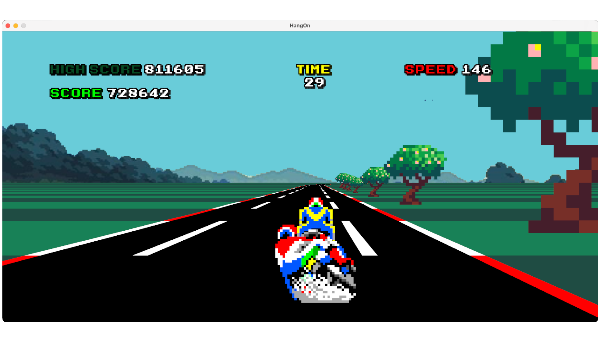

<h1 align="center">HangOn Racing</h1>

This project is a simpl replica of the classic arcade game Hang On by SEGA project uses a psuedo 3d projection to replicated 3d roads to 2d plane.

Game also provides a login and score board system integrated with a simple google Apss Script API and a Google Sheet for the database.

---

        
        
        
        
    

# Table of Contents

1. [Project Structure](#Project-Structure)
   - [Client](#client)
   - [API](#api)
   - [DB](#db)
2. [Validation](#Validation)

# Project Structure

Despite not being the main goal of this project I integrated several mechanism to add a API integration though it was something quite interesting for me.

## Client

Pure java code that consist of several classes most of which aims to generate a playable game as JFrame. In the beginnin this project was not suppose to be integrated with any online task however later I decided to add anyway.

By later I mean after the game integration. Game is purely compiled and run in local whitout need of any internet conneciton or whatsoever. And all the logic is implemented inside it.

All the extra work that put in , in order to create an online scoarboard system is inside the `Request.java` and all the methods use simple http request, actually two request `get` and `post` since Apps Script doesn't support any `put` request I handle it inside the `post`.

## API

> Google Apps Script is a scripting language based on JavaScript that allows you to automate tasks across Google Workspace (formerly G Suite) apps like Google Sheets, Google Docs, Gmail, and more.

Says chat GPT so I do not want to explain it more neither do I know more. However by automation it also apparenlty handles https request that sended into spesific url.

## DB

For database I use the simples form, a google sheet document, simply putting the data in the from of a table and manipulating it with google Apps Script gives us the combinaiton of a working DB with an API

In the Google Sheets we have columns for `user name` and a `hashed password` with additional `score` and a `token` for valdiating the score update.

# Validation

Passwords are hased with the standart `jBCrypt` library and sended to the API, since creating user requires no validaiton I simply put the data to the DB.

However when loging, we compare the login password with the actual users then validate the request with a token.

    This step ensures users only can send request to itself
    Not other users.

Unfortunetly since the game is opensource, anyone with the correct url and the tokens can update the score...

Meaning they can update the score with any value they want, even though they didn't played the gameplay at all.
